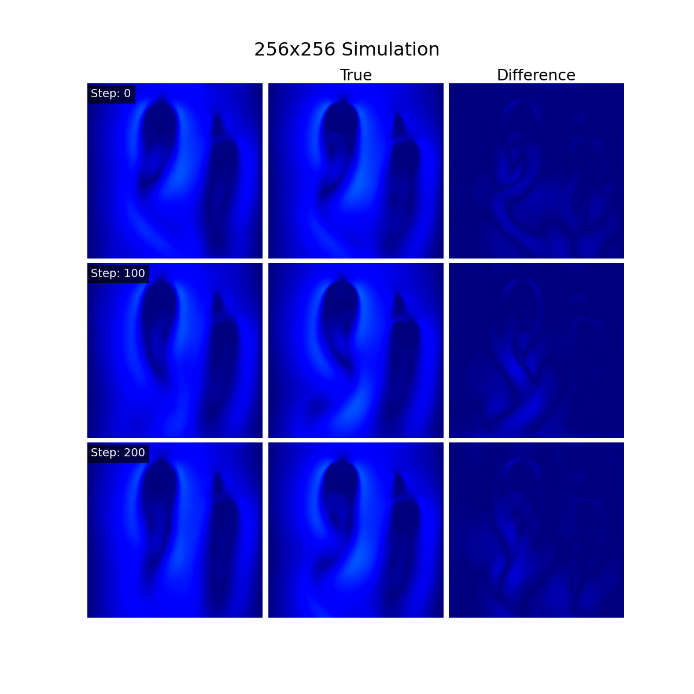

# Local Lat-Net: NPZ-Based 2D Flow Simulation

## Overview

This is a locally adapted version of [Lat-Net: Compressing Lattice Boltzmann Flow Simulations using Deep Neural Networks](https://arxiv.org/abs/1705.09036), designed to work entirely offline. The model simulates 2D Lattice Boltzmann flow by learning a compact latent representation and time-evolving it using convolutional neural networks.

This version removes dependencies on TFRecords and Google Drive, and instead uses standard `.npz` files for both training and testing.

---

## Data Generation

This version uses `.npz` files generated by the repository:  
👉 [noxYJZeng/lbm-generating-obstacles-randomly](https://github.com/noxYJZeng/lbm-generating-obstacles-randomly)

## Training and predict
To train the model enter the `train` directory and run

`
python compress_train.py
`
## Test

To predct, run

`
python predict.py \
  --dimensions=512x512 \
  --lattice_size=9 \
  --system=fluid_flow
`

## Example Output

## Colab 

https://colab.research.google.com/drive/1rh3gxTINIBxC3q_hEnQbQ37rVQL87DwA?usp=sharing
